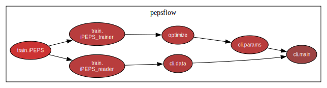

# PEPSFlow

PEPSFlow is a Python package for the simulation of PEPS (Projected Entangled Pair States) in 2D using automatic differentiation.

## How to install

Requirements: [PyTorch 1.0+](https://pytorch.org/)

1. Clone this repository.
2. Create a virtual environment (e.g. [conda](https://docs.conda.io/projects/conda/en/latest/user-guide/tasks/manage-environments.html) or [venv](https://docs.python.org/3/library/venv.html)).
3. Use the package manager [poetry](https://python-poetry.org/) to intstall the dependencies:
   ```
   $\PEPSFlow> poetry install
   ```

## How to use

The pepsflow command interface (CLI) consists of two main subcommands:

* `pepsflow params`: handling of current parameters and optimization.
* `pepsflow data`: handling the saved data.

Add `--help` to a command to show more information, e.g:

```
$\PEPSFlow> pepsflow params --help
```
```
$\PEPSFlow> pepsflow data --help
```

## Program flow and structure

<figure>
    
</figure>


See the above figure for a dependency graph of PEPSFlow. The modules are explained below:

#### **`train.iPEPS`**
Contains the class `iPEPS` which is derived from the `torch.nn.Module` class. This class represents an iPEPS state, so it has the iPEPS tensor ("A tensor") as trainable parameters and attributes like the corner and edge tensor obtained from the CTM algorithm. The `forward` method of this class executes one CTM step and computes the energy using the new corner and edge tensors. After optimization of the parameters this class is saved in the `data` folder as a `.pth` file.
#### **`train.iPEPS_trainer`**
Contains the class `iPEPSTrainer`. This class is used for optimizing the parameters and saving the resulting `train.iPEPS` instance. This class takes a dictionary of optimization parameters as argument.
#### **`train.iPEPS_reader`**
Contains the class `iPEPSReader`, which is used for reading the `train.iPEPS` instances in `.pth` files and computing observables.
#### **`optimize`**
Used for reading the parameters from the `optimize.cfg` file, translating it into a Python dictionary, and executing `train.iPEPS_trainer` with these parameters.
#### **`cli.*`**
Contains the implementation of the command line interface for both parameter and data handling.

## Results

### Transverse-field Ising Model

$$ H = \sum_{\langle i,j \rangle} \sigma_i^z \sigma_j^z- \lambda \sum_{i} \sigma_{i}^x $$

*50 warm up steps, 20 gradient steps, chi=30 for D=2 and chi is between 30 and 64 for D=3*


 

### Heisenberg Model

$$ H = \frac{1}{2} \sum_{\langle i,j \rangle} \Big( \frac{\sigma^+_i \sigma^-_j + \sigma^-_i \sigma^+_j}{2} + \sigma^z_i \sigma^z_j \Big) $$

*50 warm up steps, 20 gradient steps, D=3*


### J1-J2 Model

$$  H = J_1\sum_{\langle i,j \rangle} \mathbf{S}_i.\mathbf{S}_j + J_2 \sum _{\langle \langle i,j \rangle \rangle} \mathbf{S}_i.\mathbf{S}_j $$


## Results 


